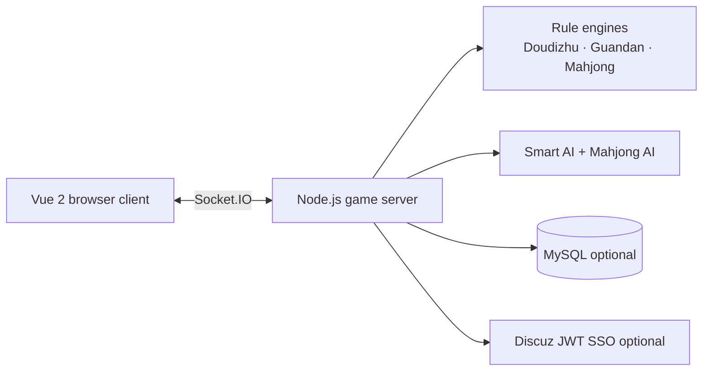

# CardRoomPro · Online Card Room

[](https://nodejs.org/)
[](https://socket.io/)
[](https://v2.vuejs.org/)
[](LICENSE)

[English](README.md) · [简体中文](README.zh-CN.md)

CardRoomPro (雀阁 · 纸牌房) is a real-time multiplayer card-room platform built with **Node.js, Socket.IO, and Vue 2**. It supports room-based play, AI seats, spectators, chat, audio feedback, Mahjong, and persistent seasonal leaderboards.

## Screenshots

<p align="center">
  
</p>

| Lobby | Guandan | Mobile |
| --- | --- | --- |
|  |  |  |

**Live demo:** [ddz.yutianfu.me](https://ddz.yutianfu.me/)

## Features

- **Three game modes:** Doudizhu (斗地主), Guandan (掼蛋), and four-player Mahjong (麻将).
- **Room system:** public/private rooms, room codes, quick join, ready states, spectators, and AI fill seats.
- **Real-time play:** Socket.IO synchronization, in-room chat, reconnect-friendly state updates, sounds, and visual effects.
- **Rule-aware AI:** legal move generation, bidding and role decisions, hand/discard evaluation, Mahjong shanten and effective-tile analysis, and discard-risk scoring.
- **Advisor mode (智囊):** highlights a legal recommendation for the local player without automatically submitting the move.
- **Season leaderboard:** separate Doudizhu, Guandan, and Mahjong rankings with podium, top-20 table, personal stats, and current-player highlighting.
- **Game history and replay:** completed rounds are saved with players, actions, results, and step-by-step replay. Public-room records are visible to everyone; private-room records are restricted to participants.
- **Usage analytics:** page visits, socket connections, game starts, completed rounds, player-rounds, and spectator visits are available from the statistics panel.
- **Optional integrations:** MySQL score persistence and Discuz-compatible JWT single sign-on.
- **Responsive UI:** lobby works on desktop and mobile; card tables are optimized for landscape play on small screens.

## Architecture



## Quick start

Requirements: **Node.js 18+** and npm.

```bash
git clone https://github.com/TypeThe0ry/CardRoomPro.git
cd CardRoomPro
npm ci
npm start
```

Open [http://localhost:8002/](http://localhost:8002/).

To use another port:

```powershell
$env:PORT = '8012'
node server.js
```

Run the AI regression suite:

```bash
npm run test:ai
```

## Game modes

| Mode | Seats | Highlights |
| --- | ---: | --- |
| Doudizhu | 3 | Bidding, landlord cards, farmer/landlord roles, bombs, spring multiplier, AI opponents |
| Guandan | 4 | Two decks, fixed partners, level progression, wild-heart level card, team scoreboard |
| Mahjong | 4 | Tile wall, draw/discard flow, chi/peng/gang/hu actions, Mahjong AI, advisor recommendations |

## Configuration

The server reads settings in this order: **environment variables → `config.json` → defaults**. Start from the checked-in example:

```bash
cp config.example.json config.json
```

| Variable | Purpose | Default |
| --- | --- | --- |
| `PORT` | HTTP and Socket.IO port | `8002` |
| `JWT_SECRET` | JWT secret shared with the SSO issuer | placeholder value |
| `DB_HOST` / `DB_PORT` | MySQL host and port | `127.0.0.1:3306` |
| `DB_USER` / `DB_PASSWORD` | MySQL credentials | unset / empty |
| `DB_NAME` | MySQL database name | unset |
| `DB_TABLE_PREFIX` | Score table prefix | `pre_` |
| `DB_DISABLE` | Set to `1` for in-memory scores | unset |
| `DISCUZ_AVATAR_BASE` | Avatar URL template; supports `{uid}` | Discuz default template |

Keep `config.json`, database credentials, JWT secrets, and SSO secrets out of Git.

## AI and advisor behavior

The bots and the local advisor are separate paths:

- **AI seats** make moves on behalf of server-managed bot players.
- **智囊** analyzes the local hand and selects/highlights a legal candidate for the human player.
- Mahjong advisor calculations include shanten, effective tiles (ukeire), remaining-tile counts, and discard danger.
- The advisor does not replace the server rule engine and does not submit a move by itself.

## Leaderboard API

Supported `gameType` values: `doudizhu`, `guandan`, and `mahjong`.

```text
GET /api/score/top?gameType=mahjong&limit=20
GET /api/score/me?gameType=mahjong&token=<JWT>
```

`limit` is clamped to a maximum of 100. Authenticated human players are recorded; guests, bots, and spectators are excluded from persistent scores.

## History and statistics API

```text
GET /api/history?gameType=all&limit=30
GET /api/history/<id>
GET /api/site-stats
```

History access is enforced on the server. Public records are readable without login; private records require the participant's JWT identity or the stable guest identity issued by the client. When MySQL is disabled, history and statistics use an in-memory fallback for the current process.

## Project layout

```text
server.js                 HTTP, Socket.IO, rooms, auth, score routes
game.js                   Doudizhu state machine and rule validation
guandan-game.js           Guandan state machine and rule validation
mahjong-game.js           Mahjong state machine and tile actions
core-ai.js                Shared AI helpers
core-validator.js         Shared legal-action validation
db.js                     Optional MySQL score persistence
static/index.html         Vue 2 client and table UI
static/js/smart-ai.js     Doudizhu/Guandan smart AI
static/js/mahjong-ai.js   Mahjong advisor and AI calculations
test/ai.test.js           AI regression tests
discuz-sso/               Discuz SSO integration examples
```

## Production notes

Run the Node process with a process manager and place an HTTPS reverse proxy in front of port `8002`:

```bash
PORT=8002 \
JWT_SECRET='replace-with-a-strong-secret' \
DB_HOST=127.0.0.1 \
DB_USER=cardroom \
DB_NAME=cardroom \
node server.js
```

Use the same `JWT_SECRET` as the SSO issuer, restrict MySQL access, and keep the application port private when Nginx or another reverse proxy is enabled.

## Search terms

online card room, multiplayer card game, real-time card game, Doudizhu, 斗地主, Guandan, 掼蛋, Mahjong, 麻将, Mahjong AI, card game AI, Node.js game server, Socket.IO game, Vue 2 card game, MySQL leaderboard, seasonal ranking, Discuz SSO.

## License

MIT. See [LICENSE](LICENSE).
