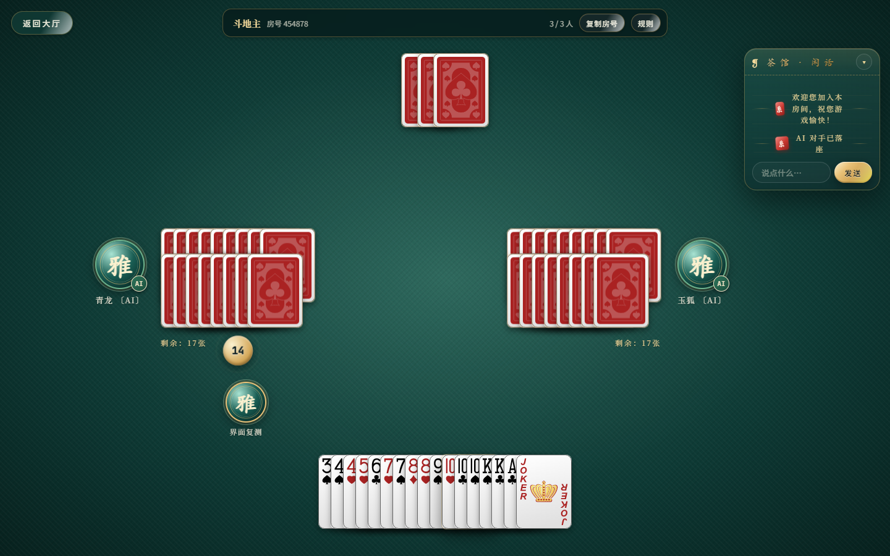
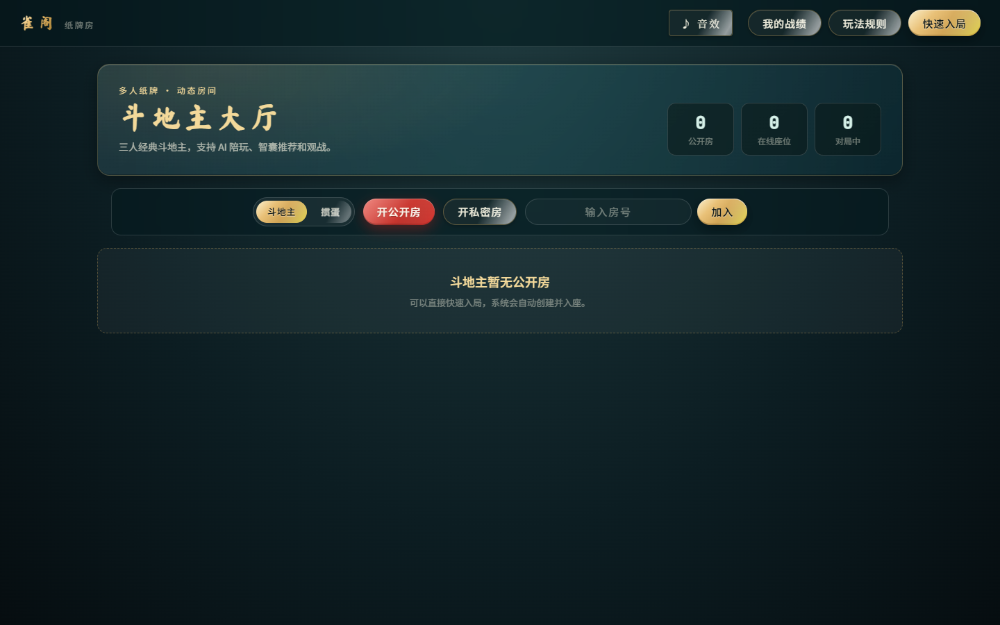
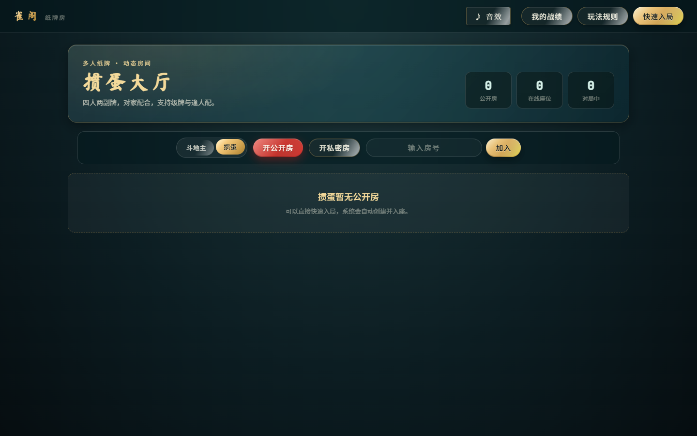
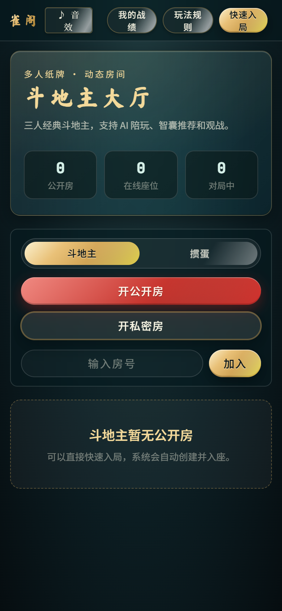

# CardRoomPro · 雀阁纸牌房

[English](README.md) · [简体中文](README.zh-CN.md)

CardRoomPro（雀阁 · 纸牌房）是一个基于 **Node.js、Socket.IO 和 Vue 2** 的实时多人牌局平台，支持房间、AI 补位、观战、聊天、音效、麻将和赛季积分榜。在线站点免费开放，GitHub 仓库是实现的权威来源。

> **一句话说明：** 用 CardRoomPro 在浏览器里玩斗地主、掼蛋或四人麻将，获得服务端规则校验、AI 对手、智囊推荐、历史复盘、MySQL 数据统计和可选 Discuz JWT 单点登录。

## 截图

<p align="center">
  
</p>

| 大厅 | 掼蛋 | 移动端 |
| --- | --- | --- |
|  |  |  |

**在线演示：** [ddz.yutianfu.me](https://ddz.yutianfu.me/)

## 功能

- **三种玩法：** 斗地主、掼蛋、四人麻将。
- **房间系统：** 公共房、私密房、房号加入、快速入局、观战和 AI 补位。
- **实时对局：** Socket.IO 同步、房间聊天、重连友好的状态更新、出牌音效和特效。
- **规则型 AI：** 合法牌型生成、叫分和角色判断、手牌/牌河评估、麻将向听与进张分析、出牌风险评分。
- **智囊：** 只为当前真人玩家选择并高亮合法推荐，不自动提交出牌。
- **赛季积分榜：** 斗地主、掼蛋、麻将分别统计，提供前三名、前 20 名、个人战绩和当前用户高亮。
- **历史战局与复盘：** 保存已完成战局的玩家、操作、结果，支持逐手回放。公开房所有人可看，私密房仅参与者可看。
- **数据统计：** 统计页面访问、Socket 连接、开局、完成战局、游玩人次和观战次数。
- **可选集成：** MySQL 积分持久化、Discuz 兼容 JWT 单点登录；支持 hash 回传、一次性 state 防串线、可选 issuer/audience 校验和密钥指纹健康检查。
- **响应式界面：** 大厅支持移动端，牌桌针对手机横屏优化。

## 快速开始

要求 Node.js 18+：

```bash
git clone https://github.com/TypeThe0ry/CardRoomPro.git
cd CardRoomPro
npm ci
npm start
```

打开 [http://localhost:8002/](http://localhost:8002/)。

指定端口：

```powershell
$env:PORT = '8012'
node server.js
```

运行 AI 回归测试：

```bash
npm run test:ai
```

从 Nginx 访问日志和旧积分表恢复历史统计：

```bash
npm run stats:backfill
```

脚本会把可恢复计数与完成战局估算分开，并将来源和估算公式写入 `pre_site_stats_meta`，不会伪造旧牌序。

## 玩法

| 玩法 | 人数 | 重点规则 |
| --- | ---: | --- |
| 斗地主 | 3 | 叫分、底牌、地主/农民、炸弹、春天倍率、AI 对手 |
| 掼蛋 | 4 | 两副牌、固定对家、升级、红桃级牌、队伍记分板 |
| 麻将 | 4 | 牌墙、摸打、吃碰杠胡、麻将 AI、智囊推荐 |

## 配置

服务端读取顺序：**环境变量 → `config.json` → 默认值**。可以先复制示例：

```bash
cp config.example.json config.json
```

常用配置：

| 配置项 | 作用 | 默认值 |
| --- | --- | --- |
| `PORT` | HTTP 和 Socket.IO 端口 | `8002` |
| `JWT_SECRET` | 与登录签发端一致的 JWT 密钥 | 占位值 |
| `JWT_ISSUER` | 可选，校验 JWT `iss` | 未配置 |
| `JWT_AUDIENCE` | 可选，校验 JWT `aud` | 未配置 |
| `ALLOW_QUERY_TOKEN` | 兼容旧版 Socket.IO URL token；生产保持关闭 | `0` |
| `DB_HOST` / `DB_PORT` | MySQL 地址和端口 | `127.0.0.1:3306` |
| `DB_USER` / `DB_PASSWORD` | MySQL 账号密码 | 未配置 / 空 |
| `DB_NAME` | 数据库名 | 未配置 |
| `DB_TABLE_PREFIX` | 积分表前缀 | `pre_` |
| `DB_DISABLE` | 设为 `1` 使用内存积分 | 未启用 |
| `DISCUZ_AVATAR_BASE` | 头像 URL 模板，支持 `{uid}` | Discuz 默认模板 |

不要把 `config.json`、数据库密码、JWT 密钥或 SSO 密钥提交到仓库。

## 智囊与 AI

- **AI 座位**由服务端机器人状态机自动出牌。
- **智囊**只分析当前真人手牌并选择/高亮合法候选，不代替服务端规则校验，也不会自行提交出牌。
- 麻将智囊会计算向听数、有效进张、剩余牌数量和牌河风险。

## 积分榜 API

`gameType` 支持：`doudizhu`、`guandan`、`mahjong`。

```text
GET /api/score/top?gameType=mahjong&limit=20
GET /api/score/me?gameType=mahjong&token=<JWT>
```

`limit` 最大为 100。只有 JWT 登录的真人玩家计入持久化积分，游客、AI 和观战用户不计分。

## 历史战局与数据接口

```text
GET /api/history?gameType=all&limit=30
GET /api/history/<id>
GET /api/site-stats
```

历史战局权限由服务端校验：公开房无需登录，私密房必须使用本局参与者的 JWT 身份或客户端稳定访客身份。未配置 MySQL 时，历史和统计会暂存在当前进程内存中。

## SSO 与 GEO/公开发现

- 网站提供 `/robots.txt`、`/sitemap.xml`、`/llms.txt` 和 `/site.webmanifest`。
- 首页公开壳包含 canonical、hreflang、Open Graph、Twitter 元数据，以及网站/网页游戏 JSON-LD 结构化数据。
- Discuz 桥接只接受白名单 HTTPS 回跳域名，JWT 通过 URL fragment 回传，并在签发前校验短时效登录 state。
- 生产保持 `ALLOW_QUERY_TOKEN=0`，SSO token 通过 Socket.IO `auth` 发送，不放进 URL 查询字符串。
- GitHub 通过双语 README、截图、仓库 topics、在线演示和稳定文档链接提升项目发现率。

## 目录

```text
server.js                 HTTP、Socket.IO、房间、认证、积分接口
game.js                   斗地主状态机和规则校验
guandan-game.js           掼蛋状态机和规则校验
mahjong-game.js           麻将状态机和牌面操作
core-ai.js                通用 AI 辅助
core-validator.js         通用合法动作校验
db.js                     可选 MySQL 积分持久化
static/index.html         Vue 2 客户端和牌桌 UI
static/js/smart-ai.js     斗地主/掼蛋智能 AI
static/js/mahjong-ai.js   麻将智囊和 AI 计算
test/ai.test.js           AI 回归测试
discuz-sso/               Discuz SSO 示例
```

## SEO 搜索词

在线棋牌游戏、多人牌局、实时棋牌游戏、斗地主、掼蛋、麻将、麻将 AI、纸牌 AI、Node.js 游戏服务端、Socket.IO 棋牌游戏、Vue 2 牌桌、MySQL 积分榜、赛季排行榜、Discuz SSO。

## License

MIT，详见 [LICENSE](LICENSE)。
